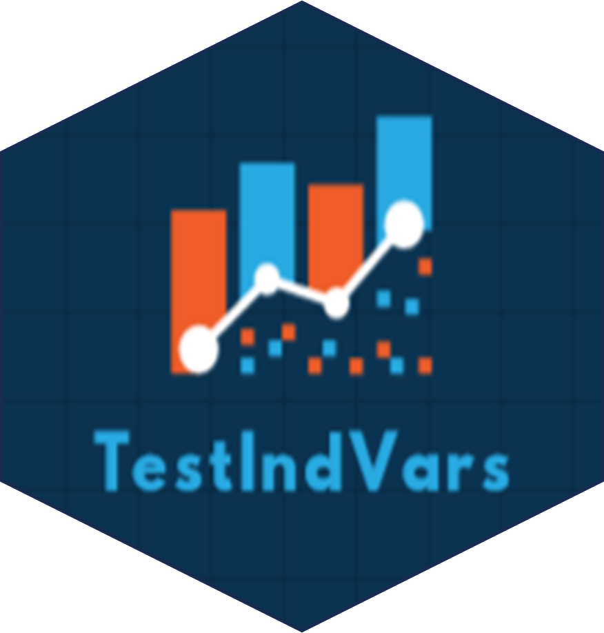

# TestIndVars 

[](https://github.com/mnrzrad/TestIndVars/actions/workflows/R-CMD-check.yaml)
[](https://cran.r-project.org/package=TestIndVars)
[](https://cran.r-project.org/package=TestIndVars)
[](https://cran.r-project.org/package=TestIndVars)
[](https://www.gnu.org/licenses/gpl-3.0.en.html)

The R package *TestIndVars* test the nullity of covariances, in a set of variables, using a simple univariate procedure. See Marques et al. (2023) <doi:10.1002/mma.9130>.

This work is funded by national funds through the FCT - Fundação para a
Ciência e a Tecnologia, I.P., under the scope of the projects
UIDB/00297/2020 and UIDP/00297/2020 (Center for Mathematics and
Applications)".

## Installation

You can install the **stable** version from
[CRAN](https://cran.r-project.org/package=TestIndVars).

``` s
install.packages('TestIndVars', dependencies = TRUE)
```

You can install the **development** version from
[Github](https://github.com/mnrzrad/TestIndVars)

``` s
# install.packages("remotes")
remotes::install_github("mnrzrad/TestIndVars")
```

## To cite package `TestIndVars` in publications use:

Marques, F. J., Norouzirad, M., Diogo, J., Bispo, R. (2023) *TestIndVars:
Testing the Independence of Variables for Specific Covariance Structures*. R package version 1.0.0,
<https://cran.r-project.org/package=TestIndVars>.

A BibTeX entry for LaTeX users is

@Manual{TestIndVars, title = {TestIndVars: Neutrosophic distributions},
author = {Filipe J. Marques and Mina Norouzirad and Joana Diogo and Regina Bispo}, year = {2023}, note = {R package version 1.0.0}, url =
{<https://cran.r-project.org/package=TestIndVars>} }

## License

This package is free and open source software, licensed under GPL-3.
